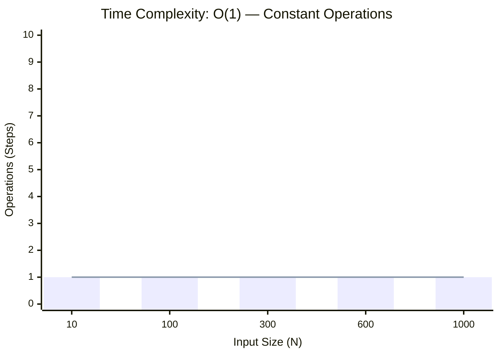
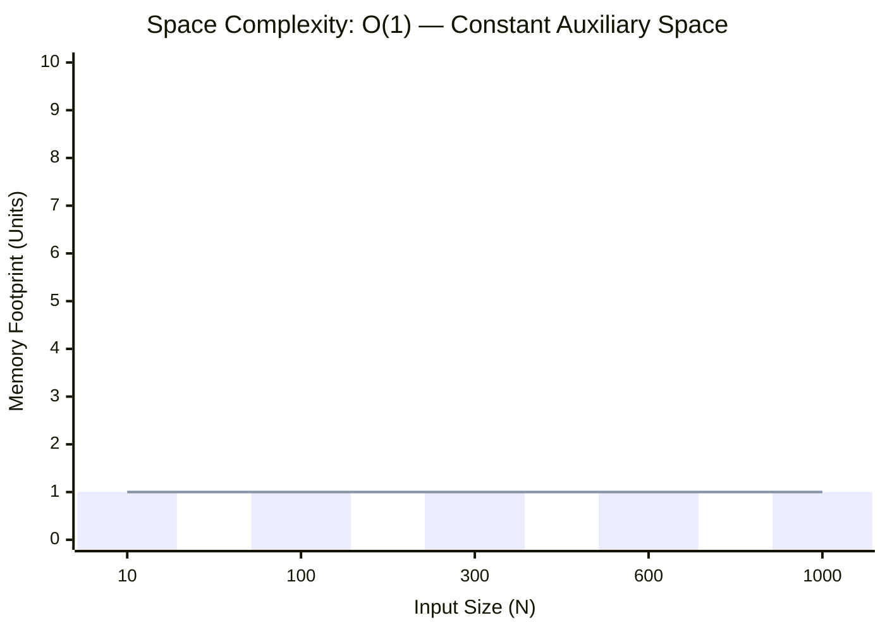

<h2><a href="https://www.geeksforgeeks.org/problems/c-basic-data-types3128/1">C++ Basic Data types</a></h2><h3>Easy</h3>

Given a String s. Find out which of the following basic C++ data types it represents and return it's size (in bytes). The possible data types are: 1. Integer 2. Float 3. Double 4. Character

<strong>Examples:</strong>
<pre><strong>Input: </strong>s<strong> </strong>= a
<strong>output: </strong>1
<strong>Explanation: </strong>The string clearly represents char and thus the size of char is displayed.</pre><pre><strong>Input </strong>s = 98.45685456
<strong>Output:</strong> 8
<strong>Explanation: </strong>The string represents Double.
</pre>

### 📊 Submission Statistics
- **Language:** `cpp`
- **Runtime:** `0 ms`
- **Memory:** `N/A`
- **Test Cases:** `9 /100005 Passed`
- **Accuracy:** `15.91%`
- **Submission Date:** Sat, 03 Oct 2026 18:54:24 GMT

---

### 💡 Approach & Complexity Analysis
#### 🧠 Intuition & Algorithmic Strategy
- **Approach:** Direct constant-time evaluation using bit manipulation, formulas, or branchless operations.
- **Flow:**
  1. Initialize state variables and inspect base constraints.
  2. Iterate through input elements, maintaining current progress and boundaries.
  3. Return the calculated result satisfying problem criteria.

#### ⏱️ Complexity Analysis
- **Time Complexity:** $\mathcal{O}(1)$ — *Constant time operations with direct arithmetic or state manipulation.*
- **Space Complexity:** $\mathcal{O}(1)$ — *In-place execution using only a constant number of auxiliary pointer variables.*

#### 📈 Time Complexity Graph (Operations vs Input Size $N$)

#### 📦 Space Complexity Graph (Memory Footprint vs Input Size $N$)

---
*Auto-synced with [LeetGitSyncPro](https://synccode-pro.pages.dev)*
