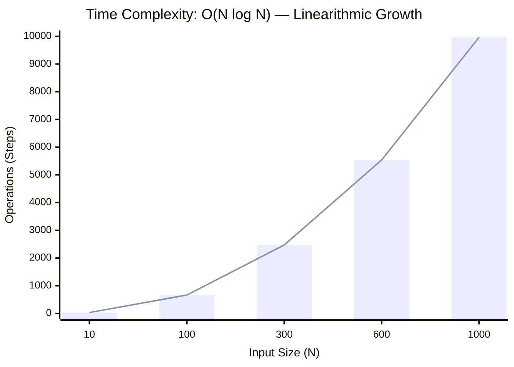
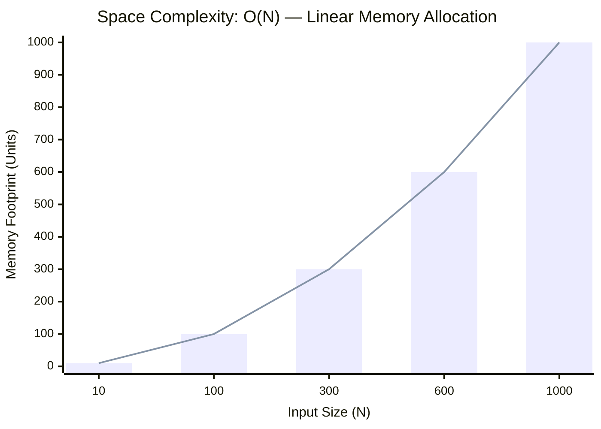

<h2><a href="https://www.geeksforgeeks.org/problems/maximum-frequency/1">Maximum Frequency with K Increments</a></h2><h3>Medium</h3>

Given an integer array <strong>arr[]</strong>.&nbsp;In one operation, you can choose an index and increment its value by 1.

Find the maximum possible frequency of any element after performing at most k operations.

<strong>Examples:</strong>
<pre><strong>Input: </strong>arr[] = [2, 2, 4], k = 4
<strong>Output:</strong> 3
<strong>Explanation:</strong> Apply two increment operations on index 0 and two operations on index 1 to make arr[]= [4, 4, 4]. Frequency of 4 is 3.
</pre><pre><strong>Input: </strong>arr[] = [7, 7, 7, 7], k = 5
<strong>Output:</strong> 4
<strong>Explanation:</strong> The frequency of 7 is already 4, so no operations are needed.</pre>

### 📊 Submission Statistics
- **Language:** `cpp`
- **Runtime:** `1113s (1113000ms)`
- **Memory:** `N/A`
- **Test Cases:** `1113 / 1113 Passed`
- **Accuracy:** `67.31%`
- **Submission Date:** Thu, 08 Oct 2026 15:14:21 GMT

---

### 💡 Approach & Complexity Analysis
#### 🧠 Intuition & Algorithmic Strategy
- **Approach:** Two-pointer convergence squeezing the search window towards the target boundaries.
- **Flow:**
  1. Initialize state variables and inspect base constraints.
  2. Iterate through input elements, maintaining current progress and boundaries.
  3. Return the calculated result satisfying problem criteria.

#### ⏱️ Complexity Analysis
- **Time Complexity:** $\mathcal{O}(N \log N)$ — *Sorting the input elements dominates the algorithmic time complexity.*
- **Space Complexity:** $\mathcal{O}(N)$ — *Auxiliary lookup table or dynamically allocated buffer storing input elements.*

#### 📈 Time Complexity Graph (Operations vs Input Size $N$)

#### 📦 Space Complexity Graph (Memory Footprint vs Input Size $N$)

---
*Auto-synced with [LeetGitSyncPro](https://synccode-pro.pages.dev)*
