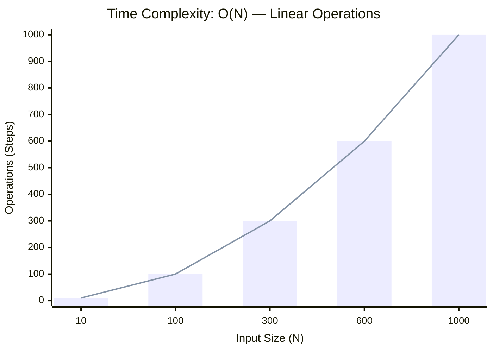
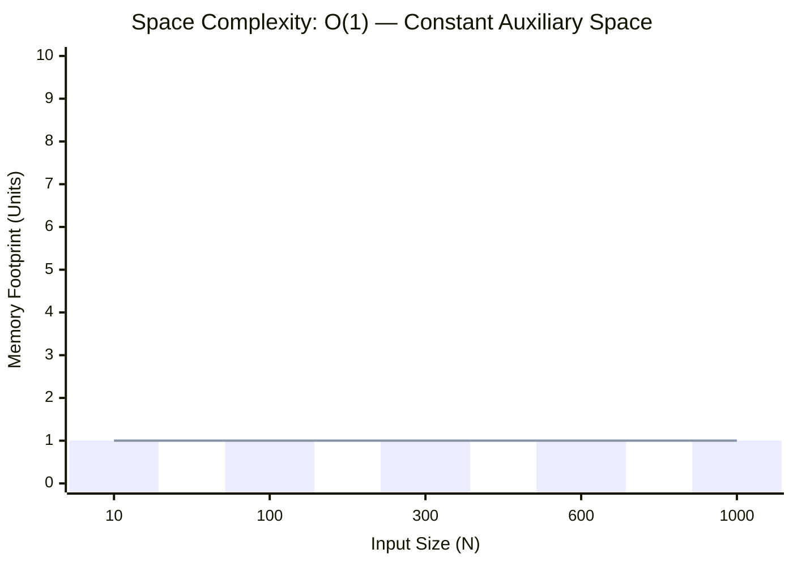

<h2><a href="https://leetcode.com/problems/palindrome-number/submissions/2133249147/">Palindrome Number</a></h2><h3>Easy</h3>

Given an integer <code>x</code>, return <code>true</code> if <code>x</code> is a <strong>palindrome</strong>, and <code>false</code> otherwise.

&nbsp;

<strong class="example">Example 1:</strong>

<pre><strong>Input:</strong> x = 121
<strong>Output:</strong> true
<strong>Explanation:</strong> 121 reads as 121 from left to right and from right to left.
</pre>

<strong class="example">Example 2:</strong>

<pre><strong>Input:</strong> x = -121
<strong>Output:</strong> false
<strong>Explanation:</strong> From left to right, it reads -121. From right to left, it becomes 121-. Therefore it is not a palindrome.
</pre>

<strong class="example">Example 3:</strong>

<pre><strong>Input:</strong> x = 10
<strong>Output:</strong> false
<strong>Explanation:</strong> Reads 01 from right to left. Therefore it is not a palindrome.
</pre>

&nbsp;

<strong>Constraints:</strong>

<ul>
	<li><code>-231&nbsp;&lt;= x &lt;= 231&nbsp;- 1</code></li>
</ul>

&nbsp;

<strong>Follow up:</strong> Could you solve it without converting the integer to a string?

### 📊 Submission Statistics
- **Language:** `cpp`
- **Runtime:** `0 ms`
- **Memory:** `N/A`
- **Submission Date:** Sun, 06 Sep 2026 19:41:33 GMT

---

### 💡 Approach & Complexity Analysis
#### 🧠 Intuition & Algorithmic Strategy
- **Approach:** Linear scan and greedy state accumulation to resolve **Palindrome Number**.
- **Flow:**
  1. Initialize state variables and inspect base constraints.
  2. Iterate through input elements, maintaining current progress and boundaries.
  3. Return the calculated result satisfying problem criteria.

#### ⏱️ Complexity Analysis
- **Time Complexity:** $\mathcal{O}(N)$ — *Single linear pass over the input collection.*
- **Space Complexity:** $\mathcal{O}(1)$ — *In-place execution using only a constant number of auxiliary pointer variables.*

#### 📈 Time Complexity Graph (Operations vs Input Size $N$)

#### 📦 Space Complexity Graph (Memory Footprint vs Input Size $N$)

---
*Auto-synced with [LeetGitSyncPro](https://synccode-pro.pages.dev) & [DSATracker](https://dsatracker.in)*
