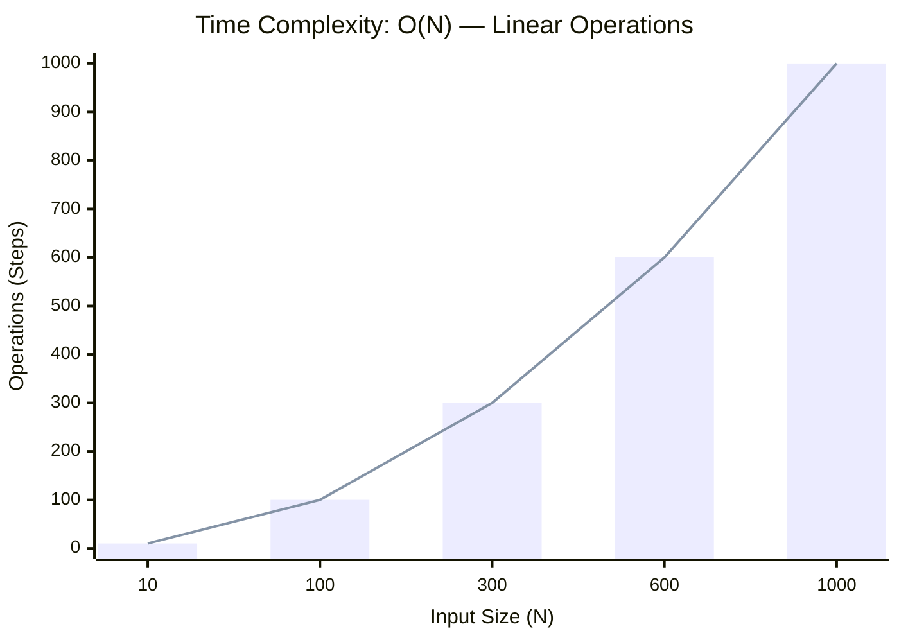
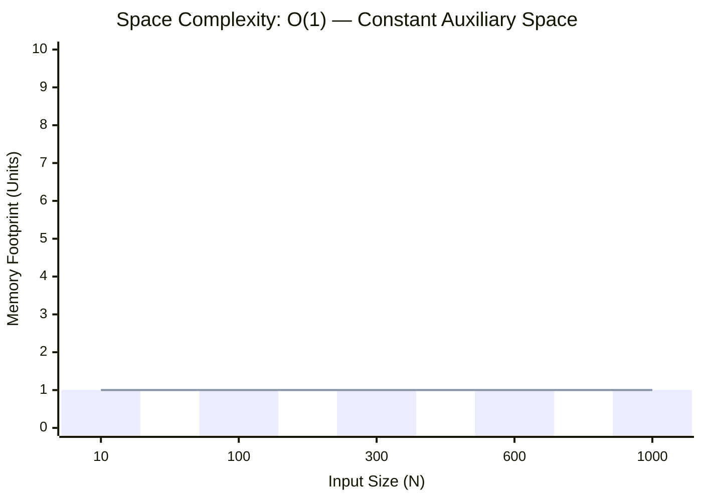

<h2><a href="https://leetcode.com/problems/reverse-integer/submissions/2161408519/">Reverse Integer</a></h2><h3>Medium</h3>

Given a signed 32-bit integer <code>x</code>, return <code>x</code><em> with its digits reversed</em>. If reversing <code>x</code> causes the value to go outside the signed 32-bit integer range <code>[-231, 231 - 1]</code>, then return <code>0</code>.

<strong>Assume the environment does not allow you to store 64-bit integers (signed or unsigned).</strong>

&nbsp;

<strong class="example">Example 1:</strong>

<pre><strong>Input:</strong> x = 123
<strong>Output:</strong> 321
</pre>

<strong class="example">Example 2:</strong>

<pre><strong>Input:</strong> x = -123
<strong>Output:</strong> -321
</pre>

<strong class="example">Example 3:</strong>

<pre><strong>Input:</strong> x = 120
<strong>Output:</strong> 21
</pre>

&nbsp;

<strong>Constraints:</strong>

<ul>
	<li><code>-231 &lt;= x &lt;= 231 - 1</code></li>
</ul>

### 📊 Submission Statistics
- **Language:** `cpp`
- **Runtime:** `0 ms`
- **Memory:** `N/A`
- **Submission Date:** Sat, 03 Oct 2026 18:56:02 GMT

---

### 💡 Approach & Complexity Analysis
#### 🧠 Intuition & Algorithmic Strategy
- **Approach:** Linear scan and greedy state accumulation to resolve **Reverse Integer**.
- **Flow:**
  1. Initialize state variables and inspect base constraints.
  2. Iterate through input elements, maintaining current progress and boundaries.
  3. Return the calculated result satisfying problem criteria.

#### ⏱️ Complexity Analysis
- **Time Complexity:** $\mathcal{O}(N)$ — *Single linear pass over the input collection.*
- **Space Complexity:** $\mathcal{O}(1)$ — *In-place execution using only a constant number of auxiliary pointer variables.*

#### 📈 Time Complexity Graph (Operations vs Input Size $N$)

#### 📦 Space Complexity Graph (Memory Footprint vs Input Size $N$)

---
*Auto-synced with [LeetGitSyncPro](https://synccode-pro.pages.dev)*
