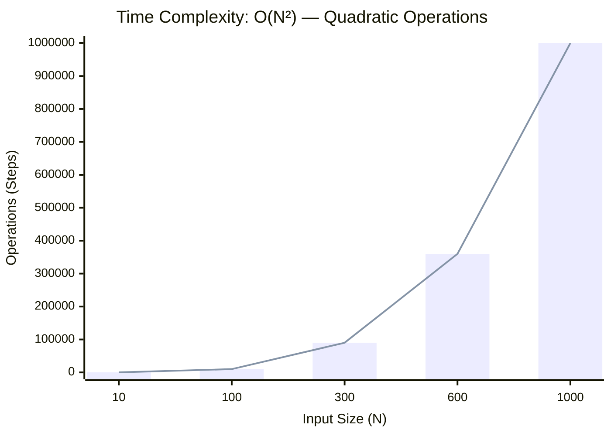
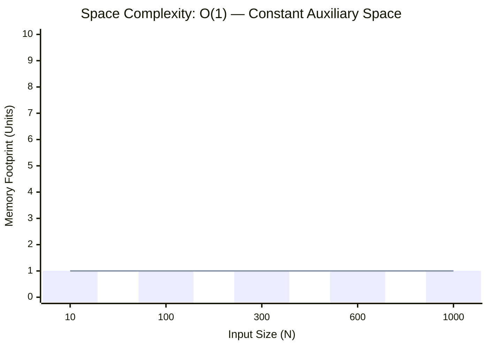

<h2><a href="https://www.geeksforgeeks.org/problems/right-angle-triangle-1605685807/1">Solid Right Angle Triangle Pattern</a></h2><h3>Easy</h3>

Given an integer<strong> n</strong><strong>. </strong>Write a program to print the Right angle triangle wall<strong>. </strong>The length of perpendicular and base is<strong> s.&nbsp; Note:</strong> Print exactly single " " after "<strong>*</strong>". Print a new line after printing the triangle.

<strong>Example:</strong>
<pre><strong>Input: </strong>n = 4
<strong>Output:
</strong>*  * *  * * *  * * * *  <strong>Explanation: </strong>Length of perpendicular and base of triangle is 4 .</pre><pre><strong>Input:</strong> n = 3
<strong>Output:
</strong>*  * *  * * *  <strong>Explanation: </strong>Length of perpendicular and base of triangle is 3 .</pre>

### 📊 Submission Statistics
- **Language:** `cpp`
- **Runtime:** `5s (5000ms)`
- **Memory:** `N/A`
- **Test Cases:** `5 / 5 Passed`
- **Accuracy:** `59.46%`
- **Submission Date:** Sat, 03 Oct 2026 19:08:05 GMT

---

### 💡 Approach & Complexity Analysis
#### 🧠 Intuition & Algorithmic Strategy
- **Approach:** Linear scan and greedy state accumulation to resolve **Solid Right Angle Triangle Pattern**.
- **Flow:**
  1. Initialize state variables and inspect base constraints.
  2. Iterate through input elements, maintaining current progress and boundaries.
  3. Return the calculated result satisfying problem criteria.

#### ⏱️ Complexity Analysis
- **Time Complexity:** $\mathcal{O}(N^2) \text{ or } \mathcal{O}(N \times M)$ — *Nested iteration processing coordinate pairs, combinations, or 2D matrix grids.*
- **Space Complexity:** $\mathcal{O}(1)$ — *In-place execution using only a constant number of auxiliary pointer variables.*

#### 📈 Time Complexity Graph (Operations vs Input Size $N$)

#### 📦 Space Complexity Graph (Memory Footprint vs Input Size $N$)

---
*Auto-synced with [LeetGitSyncPro](https://synccode-pro.pages.dev)*
