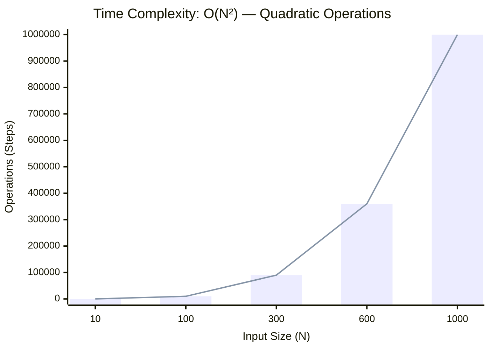
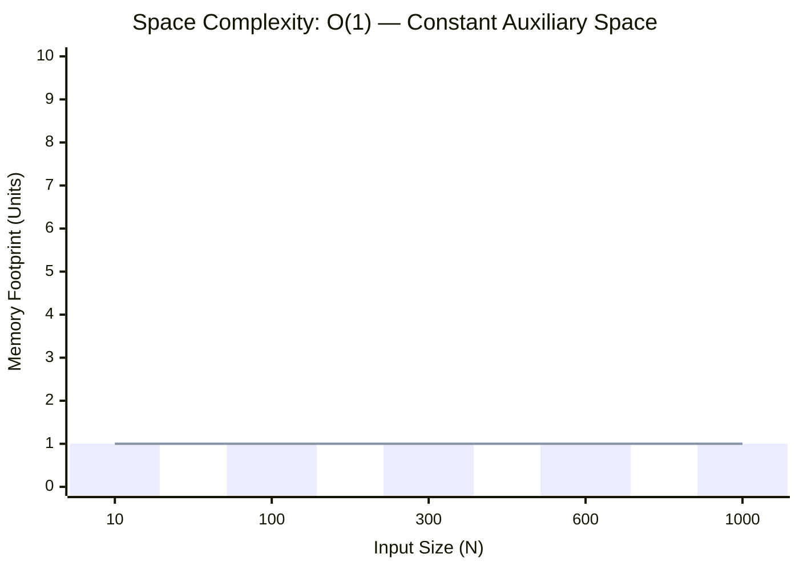

<h2><a href="https://leetcode.com/problems/valid-palindrome/submissions/2161409240/">Valid Palindrome</a></h2><h3>Easy</h3>

A phrase is a <strong>palindrome</strong> if, after converting all uppercase letters into lowercase letters and removing all non-alphanumeric characters, it reads the same forward and backward. Alphanumeric characters include letters and numbers.

Given a string <code>s</code>, return <code>true</code><em> if it is a <strong>palindrome</strong>, or </em><code>false</code><em> otherwise</em>.

&nbsp;

<strong class="example">Example 1:</strong>

<pre><strong>Input:</strong> s = "A man, a plan, a canal: Panama"
<strong>Output:</strong> true
<strong>Explanation:</strong> "amanaplanacanalpanama" is a palindrome.
</pre>

<strong class="example">Example 2:</strong>

<pre><strong>Input:</strong> s = "race a car"
<strong>Output:</strong> false
<strong>Explanation:</strong> "raceacar" is not a palindrome.
</pre>

<strong class="example">Example 3:</strong>

<pre><strong>Input:</strong> s = " "
<strong>Output:</strong> true
<strong>Explanation:</strong> s is an empty string "" after removing non-alphanumeric characters.
Since an empty string reads the same forward and backward, it is a palindrome.
</pre>

&nbsp;

<strong>Constraints:</strong>

<ul>
	<li><code>1 &lt;= s.length &lt;= 2 * 105</code></li>
	<li><code>s</code> consists only of printable ASCII characters.</li>
</ul>

### 📊 Submission Statistics
- **Language:** `cpp`
- **Runtime:** `0 ms`
- **Memory:** `N/A`
- **Submission Date:** Sat, 03 Oct 2026 18:56:56 GMT

---

### 💡 Approach & Complexity Analysis
#### 🧠 Intuition & Algorithmic Strategy
- **Approach:** Two-pointer convergence squeezing the search window towards the target boundaries.
- **Flow:**
  1. Initialize state variables and inspect base constraints.
  2. Iterate through input elements, maintaining current progress and boundaries.
  3. Return the calculated result satisfying problem criteria.

#### ⏱️ Complexity Analysis
- **Time Complexity:** $\mathcal{O}(N^2) \text{ or } \mathcal{O}(N \times M)$ — *Nested iteration processing coordinate pairs, combinations, or 2D matrix grids.*
- **Space Complexity:** $\mathcal{O}(1)$ — *In-place execution using only a constant number of auxiliary pointer variables.*

#### 📈 Time Complexity Graph (Operations vs Input Size $N$)

#### 📦 Space Complexity Graph (Memory Footprint vs Input Size $N$)

---
*Auto-synced with [LeetGitSyncPro](https://synccode-pro.pages.dev)*
